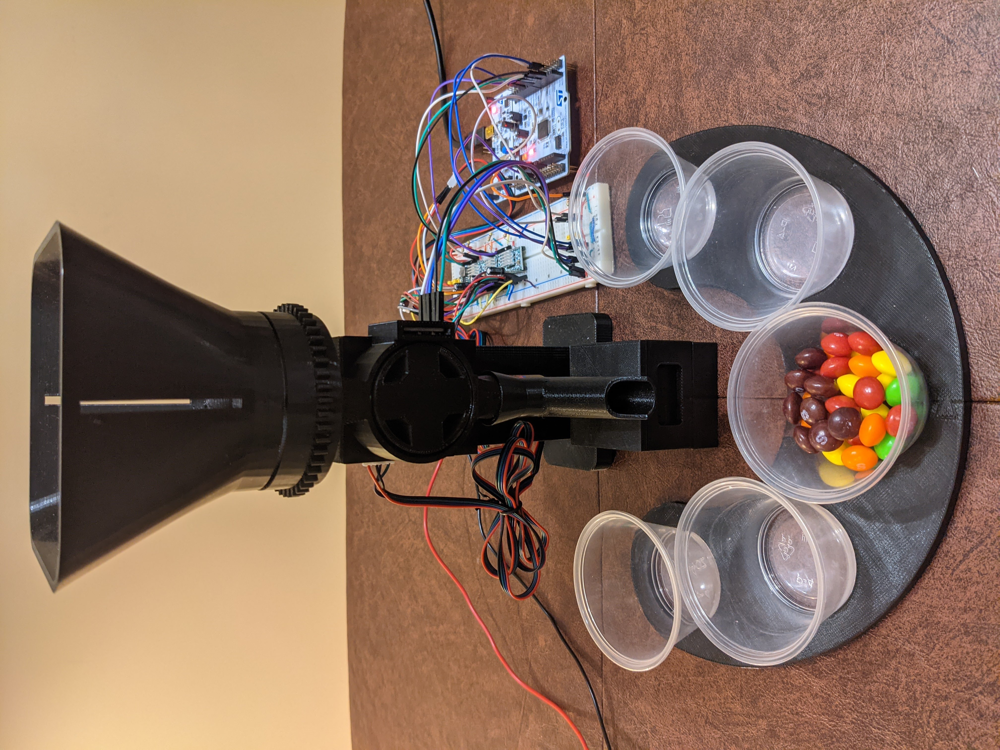

# Skittle Sorter

As its name implies, the Skittle Sorter is a device that sorts your mouth-watering-sugar-intensing-cavity-inducing candies based on their colour/flavour profile (Green Apple, Strawberry, Grape, Lemon, and Orange). 

    
   
  <i> Skittle sorting at normal speed. </i>

# How it works
The foundation of this project is a STM32-F410RB Nucleo board that communicates with a TCS3472 colour sensor and controls the angle of three NEMA 17 stepper motors. Connected to each stepper motor is a A4988 stepper-motor driver. The three motors can be separated by their function:
1. Revolver: Retrieves a single skittle from the masses within the hopper 
2. Orderly: Presents the skittle to the colour sensor in an orderly fashion
3. Disributor: Distributes the skittle to its correct container

   
  <i>Separation process at 80% speed.</i>

# Physical Design

   

# Challenges
Initial design did not consider the impact of the letter 'S' printed on each skittle. As a result of the 'S' being printed on one side, there was a 50/50 chance of the sensor was either reading the printed side or the non-printed side. Because the 'S' letter was printed in a white font, the raw sensor readings would be different compared to reading the non-printed side. 

The solution: [placeholder]

# Future Additions
1. Save colour frequency to external microSD card
2. Transfer sorting data to the cloud for post-processing
3. Provide live data visualization on server

# Colour Sensor
TCS3472
- 3x4 photodiode array and four ADC
- I2C interface, 400kHz
- Active low interrupt signal output (triggered when user-defined thresholds exceeded)
- Pin out:
  - VIN: Supply voltage (3V3 - 5V)
  - GND: Ground
  - 3V3: I2C Voltage
  - SDA: I2C Data
  - SCL: I2C Clock
  - INT: Interrupt - open drain (active low)
  - LED: LED Enable (active high, 3V3)

State Machine (Reference: AMS TCS3472 Datasheet)

1. On boot up, device is placed in low-power SLEEP state
2. Send start condition on I2C bus to initialize device into IDLE state
3. In IDLE state, 
   - If PON == 1b AND WEN == 1b AND AEN == 1b, transition to WAIT state
   - If PON == 1b AND WEN == 0b AND AEN == 1b, transition to RGBC state
   - Note: PON = Enable Register (0x00), WEN = Power management, AEN = RGBC Enable
4. In WAIT state, transition to RGBC state
5. In RGBC state, transition to IDLE state

RGBC Operation:
- RGBC integration time (ATIME) affects resolution and sensitivity of RGBC reading. Range from 2.4ms to 614ms
- RGBC gain control (AGAIN) affects the magnitude of the reading. Options: 1x, 4x, 16x, 50x

